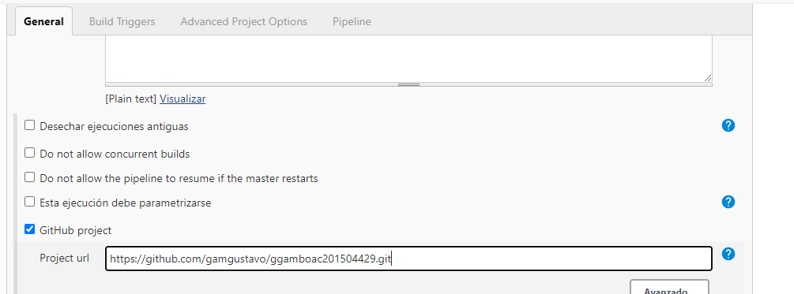

# Lab: Devops-demo Kubernetes, Google Cloud y Jenkins


## Pre-Requisitos
1.  Cuenta de [Google Cloud](https://cloud.google.com/)
2.  Repositorio de versiones [Github](https://github.com/)
2.  Cuenta en [DockerHub](https://hub.docker.com/)


## Arquitectura


## Pipeline Devops


## Paso 1: Intalación y configuración Servidor de Integración Continua

1.  Crear y seleccionar Proyecto en [Google Cloud](https://console.cloud.google.com/projectselector2/home/dashboard?organizationId=0&supportedpurview=project)
2.  Ir a [Compute Engine](https://console.cloud.google.com/compute/)
3.  Crear una Instancia con las siguientes caracteristicas como minimo:
    -   2 vCPU
    -   4 Gb Memoria RAM
    -   Sistema Operativo Centos 7
    -   Alcance del acceso: Permitir acceso completo a todas las API de cloud
    -   Permitir trafico HTTP y HTTPS
4.  Creación de corta fuegos

-   Es necesario crear un [Corta Fuegos](https://console.cloud.google.com/networking/firewalls/) el cual nos permita el uso de los diferentes puertos utilizados por nuestras instancias, en este caso nuestro servidor de integración continua necesita utilizar el puerto 8080, para fines del ejemplo habilitaremos toda la comunicación


-   Asignar Regla al servidor de integración continua, por medio de etiquetas de red


5.  Intalar Herramientas
    -   [Instalar Jenkins](https://www.jenkins.io/doc/book/installing/#red-hat-centos)
    -   [Instalar Docker](https://docs.docker.com/engine/install/centos/)
    -   [Instalar Kubernetes](https://phoenixnap.com/kb/how-to-install-kubernetes-on-centos)
    -   [Instalar GitHub](https://www.digitalocean.com/community/tutorials/how-to-install-git-on-centos-7)
    -   [Instalar NodeJS](https://www.ochobitshacenunbyte.com/2019/01/23/instalar-node-js-y-npm-en-centos-7/) v12.18.3 o superior
        - [Actualizar NodeJs a version v12.18.3](https://matthiashoys.wordpress.com/2020/01/15/how-to-upgrade-node-js-from-v6-to-v12-on-centos-linux-7/) o superior

    -   Instalar Plugins Jenkins
        -   Ir a Administrar Jenkins -> Administrar Pluging e Instalar los complementos:
            - Docker Pipeline
            - Google Kubernetes Engine


## Paso 2: Creación de Repositorio de versiones Github y creación de webhook

Webhook son eventos que desencadenan acciones, de tal forma que este será el iniciador de nuestro proceso de integración continua, cada vez que exista un cambio en determinada rama del repositorio, el servidor de integración recibira una notificación para realizar la verificación y ejecutar las acciones que correspondan.

-   [Inicio de sesión](https://github.com/login)
-   [Crear nuevo Repositorio](https://github.com/new)
-   Ir: Configuraciónes -> Webhook -> Agregar Webhook

En la url colocar http://<IP_SERVIDOR_JENKINS:PUERTO>/github-webhook/ donde se debe sustituir la dirección y el puerto utilizado por el servidor Jenkins asi como definir el parametro "Just the push event"


## Paso 3: Preparación Google Cloud Platform

-   Habilitar APIS de google Cloud

    -   [Ir a Biblioteca de APIS y servicios](https://console.cloud.google.com/apis/library) y habilitar las siguientes opciones:
        -   Compute Engine API
        -   Kubernetes Engine API
        -   Service Management API
        -   Cloud Resource Manager API
        
-   Cuenta de servicio Google Cloud

Es una cuenta que permite a aplicaciones externas interactuar con las APIS de google cloud y realizar diversas acciones dentro de los permisos otorgados.

-   Iniciar sesión y seleccionar el proyecto utilizado
-   Ir a: IAM y Administración -> Cuentas de Servicio -> Crear Cuenta de Servicio
-   Colocar Nombre y descripción para la cuenta de servicio


-   Asignar roles a cuenta de servicio
    -   Compute Engine API
    -   Kubernetes Engine API
    -   Service Management API
    -   Cloud Resource Manager API


-   Crear Key en formato JSON, guardar archivo, se utilizara en el servidor de integración continua.


## Paso 3: Creación Pipeline

-   Ingresar a Jenkins
-   Creación de proyecto en Jenkins


-   En el Tab "General" Seleccionar la url del repositorio utilizado por el proyecto



-   En el Tab "Build Trigger" Seleccionar: GitHub hook trigger GITScm polling, el cual indica que se utilizara un WebHook como iniciador del flujo de integracion.


-   En el Tab "Pipeline" Seleccionar: Pipeline script from SCM el cual indica que se utilizara un script para la creación del pipeline, el cual se encuentra en el repositrio de versiones, también se se establece las ramas que se desea utilizar en el flujo.


## Paso 4: Configuraicón credenciales en JENKINS

Jenkins necesita autenticarse frente a Google Cloud Platform y DockerHub para habilitar la comunicación.

-   Ir a: Administrar Jenkins -> Manage Credentials -> En el sub meno de "Global credentials" click en Agregar

-   Configurar DockerHub: 
    -   Kind: Username y Password como metodo de autenticación 
    -   Scope: Global
    -   Username: Usuario DockerHub
    -   Password: Clave DockerHub
    -   Id: dockerhub 
    -   Descripción


-   Configurar Google Cloud Platform
    -   Kind: Google Service Account from private Key
    -   Project name: Nombre del Proyecto en Google Cloud
    -   JSON key: Archivo private Key, generado en la cuenta de servicio


## Paso 4: Proyecto


1.  Crear clusters a ser utilizados para desplegar el proyecto, se debe identificar 1 como pruebas y otro como producción.


2. [Crear repositorio en DockerHub](https://hub.docker.com/repository/create)

Creación del repositorio en docker hub a utilizar


3.  Configurar Cluster's, proyecto y zonas del proyecto

En el archivo Jenkinsfile de la raiz del proyecto se debe configurar los siguientes parametros:

   ```
   PROJECT_ID = <PROYECTO GOOGLE CLOUD>
   CREDENTIALS_ID = <CREDENCIAL CREADA EN JENKINS>    
   
   CLUSTER_NAME_TEST = <NOMBRE DEL CLUSTER TEST> 
   LOCATION_TEST = <UBICACIÓN DEL CLUSTER TEST>
   
   CLUSTER_NAME_PROD = <NOMBRE DEL CLUSTER PROD>
   LOCATION_PROD = <UBICACIÓN DEL CLUSTER PROD>
   
   ```


4. Cofigurar repositorio de DockerHub


Configurar nombre del repositorio de DockerHub: < DOCKERHUB NOMBRE > en el archivo deployment.yaml

   ```
apiVersion: apps/v1
kind: Deployment
metadata:
  name: devops-demo-app
spec:
  selector:
    matchLabels:
      app: devops-demo
  replicas: 3
  template:
    metadata:
      labels:
        app: devops-demo
    spec:
      containers:
      - name: devops-demo
        image: "<DOCKERHUB NOMBRE>/devops-demo:latest"

---

apiVersion: v1
kind: Service
metadata:
  name: ilb-service
  annotations:
    cloud.google.com/load-balancer-type: "External"
  labels:
    app: devops-demo
spec:
  type: LoadBalancer
  selector:
    app: devops-demo
  ports:
  - port: 80
    targetPort: 5000
    protocol: TCP

   ```


Configurar nombre del repositorio de DockerHub: < DOCKERHUB NOMBRE > en el archivo Jenkinsfile

   ```


pipeline {
    agent any
    environment {
        PROJECT_ID = 'ggamboac-201504429-01'
        CREDENTIALS_ID = 'ggamboac-201504429-01'    

        CLUSTER_NAME_TEST = 'devops-demo-test'
        LOCATION_TEST = 'us-east1-c'

        CLUSTER_NAME_PROD = 'devops-demo-prod'
        LOCATION_PROD = 'us-west1-a'
                       
    }
    stages {
        stage("Checkout code") {
            steps {
                checkout scm
            }
        }
        stage("Instalación de Dependencias") {
            steps {
                sh "npm install"    
                sh "npm install mocha --save"                                
            }
        }        
        stage("Pruebas de calidad de Software") {
            steps {
                sh "npm run test"
            }
        }                
        stage("Construir Imagen") {
            steps {
                script {
                    myapp = docker.build("<DOCKERHUB NOMBRE>/devops-demo:${env.BUILD_ID}")
                }
            }
        }
        stage("Publicar Imagen") {
            steps {
                script {
                    docker.withRegistry('https://registry.hub.docker.com', 'dockerhub') {
                            myapp.push("latest")
                            myapp.push("${env.BUILD_ID}")
                    }
                }
            }
        }    
        stage('Desplegar en Pruebas') {
            steps{
                sh "sed -i 's/devops-demo:latest/devops-demo:${env.BUILD_ID}/g' deployment.yaml"
                step([$class: 'KubernetesEngineBuilder', projectId: env.PROJECT_ID, clusterName: env.CLUSTER_NAME_TEST, location: env.LOCATION_TEST, manifestPattern: 'deployment.yaml', credentialsId: env.CREDENTIALS_ID, verifyDeployments: true])
            }
        }        
        stage('Despliegue en Producción') {
            steps{                                                         
                input message:"¿Autorizar Despliegue?"
                step([$class: 'KubernetesEngineBuilder', projectId: env.PROJECT_ID, clusterName: env.CLUSTER_NAME_PROD, location: env.LOCATION_PROD, manifestPattern: 'deployment.yaml', credentialsId: env.CREDENTIALS_ID, verifyDeployments: true]) 
            }
        }
    }    
}

   ```